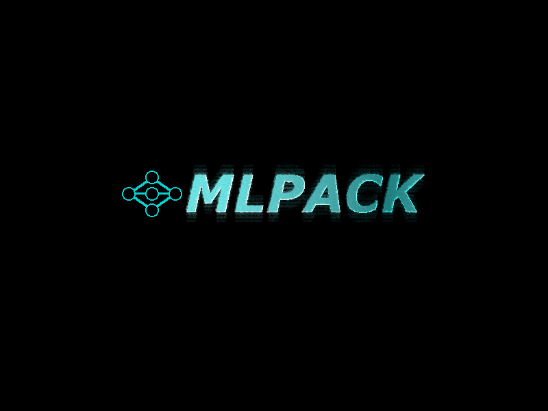

# MLPack

     

A work-in-progress general purpose machine learning library written in python only using numpy and h5py. 
MLPack provides lightweight implementations of many popular machine learning algorithms and models,
all with fully customizable parameters.
<h4> The agorithms implemented include (but are not limited to): </h4>
<ul>
<li>Standard neural networks</li>
<li>Hard margin Support vector machines (with kernels)</li>
<li>Gaussian naive bayes</li>
<li>K-Means Clustering</li>
<li>Perceptron model</li>
</ul>

<h2>Dependencies</h2>
<ul>
<li>numpy</li>
<li>h5py</li>
</ul>
